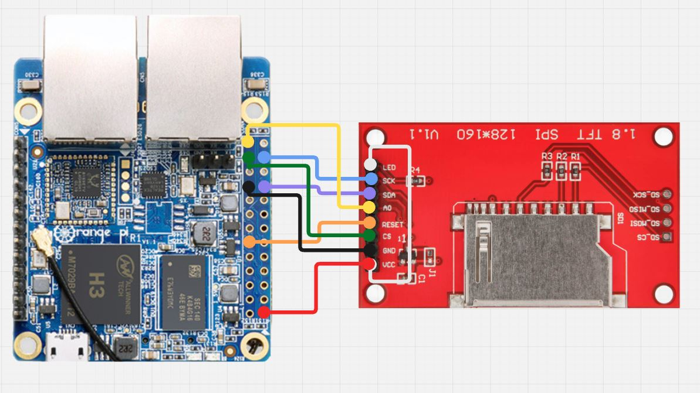
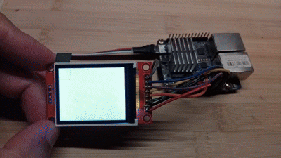

# Orange Pi R1 Yocto experiments

This repository contains a custom Yocto Project for Orange Pi R1, and Weather station - simple QML project for this board

Here is how to connect the display to the board:



And here is how it actually works:




## Repository Structure

- `meta-atwice291-opir1/` — my patches for Orange Pi R1.
- `conf/` — local configuration files (e.g. `local.conf`, `bblayers.conf`).
- `setup-env.sh` — environment setup script.
- `weatherStation/` — QML project for weather station.

## Quick Start

Clone this repository and initialize the environment:

```bash
git clone https://github.com/ATwice291/opir1.git
cd opir1
. setup-env.sh
